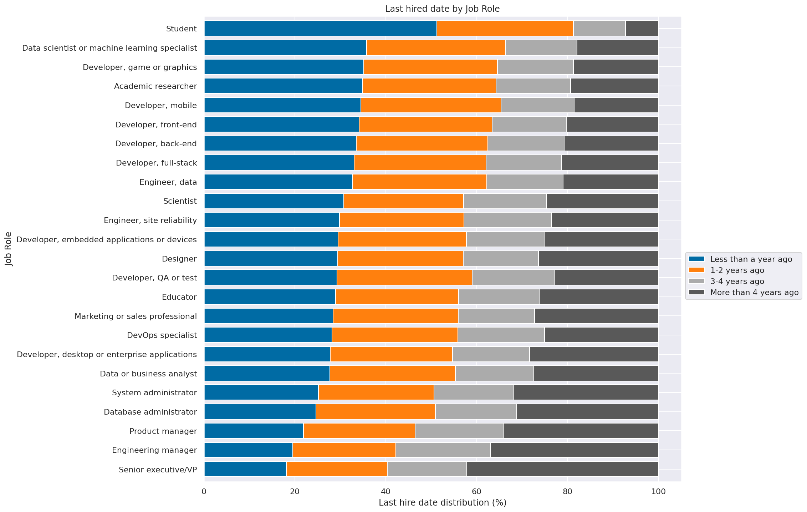

# What factors lead developers to stay longer in their current jobs ?


```python
import pandas as pd
import seaborn as sns
import matplotlib.pyplot as plt
from data_helpers import bucketize_last_hire_date
from data_helpers import transform_coding_experience
from data_helpers import filter_employed_developers

%matplotlib inline
%config InlineBackend.figure_format = 'retina'
sns.set(color_codes=True)
```

## Loading data


```python
df = pd.read_csv('data/stackoverflow-2019/survey_results_public.csv')
df.head()
```


<div>
<style scoped>
    .dataframe tbody tr th:only-of-type {
        vertical-align: middle;
    }

    .dataframe tbody tr th {
        vertical-align: top;
    }

    .dataframe thead th {
        text-align: right;
    }
</style>
<table border="1" class="dataframe">
  <thead>
    <tr style="text-align: right;">
      <th></th>
      <th>Respondent</th>
      <th>MainBranch</th>
      <th>Hobbyist</th>
      <th>OpenSourcer</th>
      <th>OpenSource</th>
      <th>Employment</th>
      <th>Country</th>
      <th>Student</th>
      <th>EdLevel</th>
      <th>UndergradMajor</th>
      <th>...</th>
      <th>WelcomeChange</th>
      <th>SONewContent</th>
      <th>Age</th>
      <th>Gender</th>
      <th>Trans</th>
      <th>Sexuality</th>
      <th>Ethnicity</th>
      <th>Dependents</th>
      <th>SurveyLength</th>
      <th>SurveyEase</th>
    </tr>
  </thead>
  <tbody>
    <tr>
      <th>0</th>
      <td>1</td>
      <td>I am a student who is learning to code</td>
      <td>Yes</td>
      <td>Never</td>
      <td>The quality of OSS and closed source software ...</td>
      <td>Not employed, and not looking for work</td>
      <td>United Kingdom</td>
      <td>No</td>
      <td>Primary/elementary school</td>
      <td>NaN</td>
      <td>...</td>
      <td>Just as welcome now as I felt last year</td>
      <td>Tech articles written by other developers;Indu...</td>
      <td>14.0</td>
      <td>Man</td>
      <td>No</td>
      <td>Straight / Heterosexual</td>
      <td>NaN</td>
      <td>No</td>
      <td>Appropriate in length</td>
      <td>Neither easy nor difficult</td>
    </tr>
    <tr>
      <th>1</th>
      <td>2</td>
      <td>I am a student who is learning to code</td>
      <td>No</td>
      <td>Less than once per year</td>
      <td>The quality of OSS and closed source software ...</td>
      <td>Not employed, but looking for work</td>
      <td>Bosnia and Herzegovina</td>
      <td>Yes, full-time</td>
      <td>Secondary school (e.g. American high school, G...</td>
      <td>NaN</td>
      <td>...</td>
      <td>Just as welcome now as I felt last year</td>
      <td>Tech articles written by other developers;Indu...</td>
      <td>19.0</td>
      <td>Man</td>
      <td>No</td>
      <td>Straight / Heterosexual</td>
      <td>NaN</td>
      <td>No</td>
      <td>Appropriate in length</td>
      <td>Neither easy nor difficult</td>
    </tr>
    <tr>
      <th>2</th>
      <td>3</td>
      <td>I am not primarily a developer, but I write co...</td>
      <td>Yes</td>
      <td>Never</td>
      <td>The quality of OSS and closed source software ...</td>
      <td>Employed full-time</td>
      <td>Thailand</td>
      <td>No</td>
      <td>Bachelor’s degree (BA, BS, B.Eng., etc.)</td>
      <td>Web development or web design</td>
      <td>...</td>
      <td>Just as welcome now as I felt last year</td>
      <td>Tech meetups or events in your area;Courses on...</td>
      <td>28.0</td>
      <td>Man</td>
      <td>No</td>
      <td>Straight / Heterosexual</td>
      <td>NaN</td>
      <td>Yes</td>
      <td>Appropriate in length</td>
      <td>Neither easy nor difficult</td>
    </tr>
    <tr>
      <th>3</th>
      <td>4</td>
      <td>I am a developer by profession</td>
      <td>No</td>
      <td>Never</td>
      <td>The quality of OSS and closed source software ...</td>
      <td>Employed full-time</td>
      <td>United States</td>
      <td>No</td>
      <td>Bachelor’s degree (BA, BS, B.Eng., etc.)</td>
      <td>Computer science, computer engineering, or sof...</td>
      <td>...</td>
      <td>Just as welcome now as I felt last year</td>
      <td>Tech articles written by other developers;Indu...</td>
      <td>22.0</td>
      <td>Man</td>
      <td>No</td>
      <td>Straight / Heterosexual</td>
      <td>White or of European descent</td>
      <td>No</td>
      <td>Appropriate in length</td>
      <td>Easy</td>
    </tr>
    <tr>
      <th>4</th>
      <td>5</td>
      <td>I am a developer by profession</td>
      <td>Yes</td>
      <td>Once a month or more often</td>
      <td>OSS is, on average, of HIGHER quality than pro...</td>
      <td>Employed full-time</td>
      <td>Ukraine</td>
      <td>No</td>
      <td>Bachelor’s degree (BA, BS, B.Eng., etc.)</td>
      <td>Computer science, computer engineering, or sof...</td>
      <td>...</td>
      <td>Just as welcome now as I felt last year</td>
      <td>Tech meetups or events in your area;Courses on...</td>
      <td>30.0</td>
      <td>Man</td>
      <td>No</td>
      <td>Straight / Heterosexual</td>
      <td>White or of European descent;Multiracial</td>
      <td>No</td>
      <td>Appropriate in length</td>
      <td>Easy</td>
    </tr>
  </tbody>
</table>
<p>5 rows × 85 columns</p>
</div>


```python
df.shape
```


    (88883, 85)


```python
df2 = pd.read_csv('data/stackoverflow-2019/survey_results_schema.csv')
df2.head()
```


<div>
<style scoped>
    .dataframe tbody tr th:only-of-type {
        vertical-align: middle;
    }

    .dataframe tbody tr th {
        vertical-align: top;
    }

    .dataframe thead th {
        text-align: right;
    }
</style>
<table border="1" class="dataframe">
  <thead>
    <tr style="text-align: right;">
      <th></th>
      <th>Column</th>
      <th>QuestionText</th>
    </tr>
  </thead>
  <tbody>
    <tr>
      <th>0</th>
      <td>Respondent</td>
      <td>Randomized respondent ID number (not in order ...</td>
    </tr>
    <tr>
      <th>1</th>
      <td>MainBranch</td>
      <td>Which of the following options best describes ...</td>
    </tr>
    <tr>
      <th>2</th>
      <td>Hobbyist</td>
      <td>Do you code as a hobby?</td>
    </tr>
    <tr>
      <th>3</th>
      <td>OpenSourcer</td>
      <td>How often do you contribute to open source?</td>
    </tr>
    <tr>
      <th>4</th>
      <td>OpenSource</td>
      <td>How do you feel about the quality of open sour...</td>
    </tr>
  </tbody>
</table>
</div>


## Part I: Does the job role lead the developers stay longer in the job?

First, we need to find in the data how can we calculate how long each professional stays in a job.


```python
df2[df2.QuestionText == 'When was the last time that you took a job with a new employer?']['Column'].values[0]
```


    'LastHireDate'


```python
df.LastHireDate.value_counts()
```


    Less than a year ago                                    25844
    1-2 years ago                                           21365
    More than 4 years ago                                   14594
    3-4 years ago                                           11597
    NA - I am an independent contractor or self employed     3426
    I've never had a job                                     3028
    Name: LastHireDate, dtype: int64


```python
df2[df2.QuestionText == 'Which of the following best describes your current employment status?']['Column'].values[0]
```


    'Employment'


```python
df.Employment.value_counts()
```


    Employed full-time                                      64440
    Independent contractor, freelancer, or self-employed     8511
    Not employed, but looking for work                       5600
    Employed part-time                                       4469
    Not employed, and not looking for work                   3803
    Retired                                                   358
    Name: Employment, dtype: int64


As we are interested only in analyzing professional who currently work for a employer, we are going to filter other professionals out of our data set.


```python
p1_df = df.copy()
p1_df = filter_employed_developers(p1_df)
p1_df.shape
```


    (68063, 85)


Now, we also have to find how to extract different job titles from the interviewed professionals.


```python
df2[df2.QuestionText == 'Which of the following describe you? Please select all that apply.']['Column'].values[0]
```


    'DevType'


```python
p1_df.DevType.value_counts().head()
```


    Developer, full-stack                                             7550
    Developer, back-end                                               4550
    Developer, back-end;Developer, front-end;Developer, full-stack    2072
    Developer, front-end                                              1961
    Developer, mobile                                                 1938
    Name: DevType, dtype: int64


We definitely started to understand our data! We have information about how long professionals are in their current jobs and we can analyze it by job role. However, first, we need to transform the data to use it properly.

### Data preparation

First, we need to convert `LastHireDate` to discrete values:

| Answer | Bucket |
| --- | --- |
| Less than a year ago | 1 |
| 1-2 years ago | 2 |
| 3-4 years ago | 3 |
| More than 4 years ago | 4 |


```python
p1_df.loc[:,'YearsInTheJob'] = p1_df['LastHireDate'].apply(bucketize_last_hire_date)
p1_df['YearsInTheJob'].value_counts()
```


     1    22378
     2    19080
     4    13453
     3    10531
    -1     2621
    Name: YearsInTheJob, dtype: int64


Then, we need to clean `DevType`. As a professional can have multiple job roles and we are interested in analyzing `YearsInTheJob` per job role, we will attribute `YearsInTheJob` to each job role defined by the professional.


```python
p1_df.loc[:,'JobRole'] = p1_df['DevType'].apply(lambda x: str(x).split(';'))
p1_df = p1_df.explode('JobRole')
p1_df = p1_df[p1_df.JobRole != 'nan']
p1_df[['JobRole', 'YearsInTheJob']].head()
```


<div>
<style scoped>
    .dataframe tbody tr th:only-of-type {
        vertical-align: middle;
    }

    .dataframe tbody tr th {
        vertical-align: top;
    }

    .dataframe thead th {
        text-align: right;
    }
</style>
<table border="1" class="dataframe">
  <thead>
    <tr style="text-align: right;">
      <th></th>
      <th>JobRole</th>
      <th>YearsInTheJob</th>
    </tr>
  </thead>
  <tbody>
    <tr>
      <th>2</th>
      <td>Designer</td>
      <td>2</td>
    </tr>
    <tr>
      <th>2</th>
      <td>Developer, back-end</td>
      <td>2</td>
    </tr>
    <tr>
      <th>2</th>
      <td>Developer, front-end</td>
      <td>2</td>
    </tr>
    <tr>
      <th>2</th>
      <td>Developer, full-stack</td>
      <td>2</td>
    </tr>
    <tr>
      <th>3</th>
      <td>Developer, full-stack</td>
      <td>1</td>
    </tr>
  </tbody>
</table>
</div>


Let's also prepared `YearsCode` variable:


```python
p1_df['YearsCodePro'] = p1_df['YearsCodePro'].fillna(value=-1)
p1_df.loc[:,'YearsCodePro'] = p1_df['YearsCodePro'].apply(transform_coding_experience)
```

### Answering the question

For each job role, we want to know what is the most frequent `YearsInTheJob` value. As `YearsInTheJob` is not continuous, we will use the `mode` of this variable.


```python
agg_p1_df = p1_df.groupby(['JobRole']).agg({'YearsInTheJob': lambda x: x.value_counts().index[0]})\
                 .sort_values(by='YearsInTheJob', ascending=False)\
                 .reset_index()

plt.figure(figsize=(12,6))
sns.barplot(x='YearsInTheJob', y='JobRole', orient='h', data=agg_p1_df, color='cornflowerblue');
plt.title('Years in the current job by job role (mode)');
```


    

    


#### Conclusions

* There are 6 job roles where most of professionals are 4 years or more in their current jobs:

  * System administrator
  * Database administrator
  * Senior executive/VP
  * Product manager
  * Engineering manager
  * Developer, desktop or enterprise applications


* It seems professionals working in management positions stay longer in their jobs. A hypothesis is those professionals developed their entire careers in the same company. That is something we will investigate in the second part of this analysis. The only exception in this pattern is `Developer, desktop or enterprise applications`.


* We can also observe the mode for `Developer QA or test` is higher than for the other developers.


Regarding the remaining job roles, we observe turn-over may be high as mostly of the interviewed professionals are less than 1 year in their jobs. Or maybe these professionals may be in the beginning of their careers. Let's drill our analysis down in more variables for each job role. Let's get started by years coding (experience).


```python
sns.set(font_scale=1.6)

job_roles = sorted(agg_p1_df.JobRole.unique())

fig = plt.figure(figsize=(32, 32))
fig.subplots_adjust(hspace=0.4, wspace=0.4)

top_roles = ['System administrator', 'Database administrator', 'Senior executive/VP', 'Product manager', 
             'Engineering manager', 'Developer, desktop or enterprise applications']

for idx, job_role in enumerate(job_roles):
    ax = fig.add_subplot(5, 5, idx + 1)
    
    data = p1_df[p1_df.JobRole == job_role][['YearsCodePro']]
    
    if job_role in top_roles:
        sns.histplot(data=data, bins=20, ax=ax, x='YearsCodePro', color='darkorange', kde=True)
    else:
        sns.histplot(data=data, bins=20, ax=ax, x='YearsCodePro', kde=True)
      
    ax.set(xlabel='Years coding pro', ylabel='density')
    ax.set_title(job_role)
    
plt.show();

sns.set(font_scale=1)
```


    

    


#### Conclusions

* `YearsCoding` distribution is very similar for job roles where most of professionals are **less than 1 year** in their jobs.
* For professionals who are longer in their jobs (orange plots), we can observe, for management roles, the interviewed professionals are more experienced.

## Part II: Wishing to become a manager leads developers stay longer in a job ?


```python
df2[df2.QuestionText == 'Do you want to become a manager yourself in the future?']['Column'].values[0]
```


    'MgrWant'


```python
p1_df['MgrWant'].value_counts()
```


    Not sure                  60504
    No                        54326
    Yes                       44987
    I am already a manager     9434
    Name: MgrWant, dtype: int64


```python
manager_df = p1_df[p1_df['MgrWant'].isin(['Yes'])].groupby(['JobRole']).size() / p1_df.groupby(['JobRole']).size()
manager_df.sort_values(ascending=False).head()
```


    JobRole
    Developer, mobile                  0.284702
    Designer                           0.276505
    Data or business analyst           0.269758
    Academic researcher                0.261189
    Marketing or sales professional    0.250000
    dtype: float64


We can observe, professionals who are `Developer mobile`, `Designer`, `Data or business analyst`, `Academic researcher` or `Marketing or sales professional` are more willing to become a manager. Let's check weather they are more willing to stay longer in their current jobs.

Let's get started by filtering our current result set by professionals who currently are not a manager but wish to become one.


```python
p2_df = p1_df[(p1_df.MgrWant == 'Yes') &
              (~p1_df.JobRole.isin(['Senior executive/VP', 'Product manager', 'Engineering manager']))
]

p2_df.shape
```


    (44343, 87)


```python
agg_p2_df = p2_df.groupby(['JobRole']).agg({'YearsInTheJob': lambda x: x.value_counts().index[0]})\
                 .sort_values(by='YearsInTheJob', ascending=False)\
                 .reset_index()

plt.figure(figsize=(12,6))
sns.barplot(x='YearsInTheJob', y='JobRole', orient='h', data=agg_p2_df, color='cornflowerblue');
plt.title('Years in the current job by job role when whishing to become a manager');
```


    

    


#### Conclusions

It seems that wishing to become a manager in the future does not make professionals stay longer in their current jobs. The mode for most of professionals also concentrate in 1 (**less than 1 year**). Maybe it changes for experienced professionals. Let's analyze professionals with at least 10 years of experience.


```python
df2[df2.QuestionText == 'How many years have you coded professionally (as a part of your work)?']['Column'].values[0]
```


    'YearsCodePro'


```python
p2a_df = p2_df[p2_df.YearsCodePro >= 10]
p2a_df.shape
```


    (7954, 87)


```python
agg_p2a_df = p2a_df.groupby(['JobRole']).agg({'YearsInTheJob': lambda x: x.value_counts().index[0]})\
                 .sort_values(by='YearsInTheJob', ascending=False)\
                 .reset_index()

plt.figure(figsize=(12,6))
sns.barplot(x='YearsInTheJob', y='JobRole', orient='h', data=agg_p2a_df, color='cornflowerblue');
plt.title('Years in the current job by job role when whishing to become a manager (> 10 years coding)');
```


    

    


#### Conclusions

Based on the last plot, the data suggest our hypothesis is promising. Most of the pore experienced developers who wish to become a manager in the future are longer in their current jobs!


```python

```
