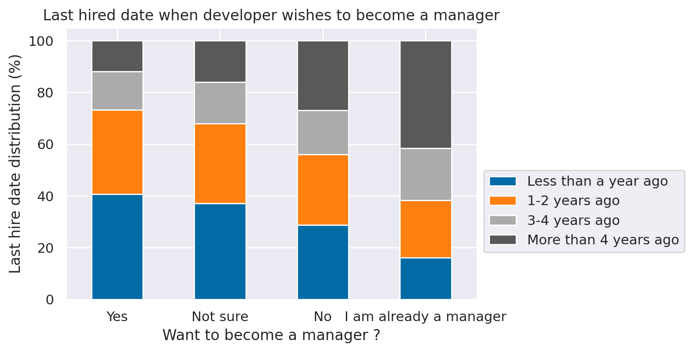

# What factors lead developers to stay longer in their current jobs ?


```python
import pandas as pd
import seaborn as sns
import matplotlib.pyplot as plt
from data_helpers import transform_coding_experience
from data_helpers import filter_employed_developers

%matplotlib inline
%config InlineBackend.figure_format = 'retina'
sns.set(color_codes=True)
```

## Loading data


```python
df = pd.read_csv('data/stackoverflow-2019/survey_results_public.csv')
df.head()
```


<div>
<style scoped>
    .dataframe tbody tr th:only-of-type {
        vertical-align: middle;
    }

    .dataframe tbody tr th {
        vertical-align: top;
    }

    .dataframe thead th {
        text-align: right;
    }
</style>
<table border="1" class="dataframe">
  <thead>
    <tr style="text-align: right;">
      <th></th>
      <th>Respondent</th>
      <th>MainBranch</th>
      <th>Hobbyist</th>
      <th>OpenSourcer</th>
      <th>OpenSource</th>
      <th>Employment</th>
      <th>Country</th>
      <th>Student</th>
      <th>EdLevel</th>
      <th>UndergradMajor</th>
      <th>...</th>
      <th>WelcomeChange</th>
      <th>SONewContent</th>
      <th>Age</th>
      <th>Gender</th>
      <th>Trans</th>
      <th>Sexuality</th>
      <th>Ethnicity</th>
      <th>Dependents</th>
      <th>SurveyLength</th>
      <th>SurveyEase</th>
    </tr>
  </thead>
  <tbody>
    <tr>
      <th>0</th>
      <td>1</td>
      <td>I am a student who is learning to code</td>
      <td>Yes</td>
      <td>Never</td>
      <td>The quality of OSS and closed source software ...</td>
      <td>Not employed, and not looking for work</td>
      <td>United Kingdom</td>
      <td>No</td>
      <td>Primary/elementary school</td>
      <td>NaN</td>
      <td>...</td>
      <td>Just as welcome now as I felt last year</td>
      <td>Tech articles written by other developers;Indu...</td>
      <td>14.0</td>
      <td>Man</td>
      <td>No</td>
      <td>Straight / Heterosexual</td>
      <td>NaN</td>
      <td>No</td>
      <td>Appropriate in length</td>
      <td>Neither easy nor difficult</td>
    </tr>
    <tr>
      <th>1</th>
      <td>2</td>
      <td>I am a student who is learning to code</td>
      <td>No</td>
      <td>Less than once per year</td>
      <td>The quality of OSS and closed source software ...</td>
      <td>Not employed, but looking for work</td>
      <td>Bosnia and Herzegovina</td>
      <td>Yes, full-time</td>
      <td>Secondary school (e.g. American high school, G...</td>
      <td>NaN</td>
      <td>...</td>
      <td>Just as welcome now as I felt last year</td>
      <td>Tech articles written by other developers;Indu...</td>
      <td>19.0</td>
      <td>Man</td>
      <td>No</td>
      <td>Straight / Heterosexual</td>
      <td>NaN</td>
      <td>No</td>
      <td>Appropriate in length</td>
      <td>Neither easy nor difficult</td>
    </tr>
    <tr>
      <th>2</th>
      <td>3</td>
      <td>I am not primarily a developer, but I write co...</td>
      <td>Yes</td>
      <td>Never</td>
      <td>The quality of OSS and closed source software ...</td>
      <td>Employed full-time</td>
      <td>Thailand</td>
      <td>No</td>
      <td>Bachelor’s degree (BA, BS, B.Eng., etc.)</td>
      <td>Web development or web design</td>
      <td>...</td>
      <td>Just as welcome now as I felt last year</td>
      <td>Tech meetups or events in your area;Courses on...</td>
      <td>28.0</td>
      <td>Man</td>
      <td>No</td>
      <td>Straight / Heterosexual</td>
      <td>NaN</td>
      <td>Yes</td>
      <td>Appropriate in length</td>
      <td>Neither easy nor difficult</td>
    </tr>
    <tr>
      <th>3</th>
      <td>4</td>
      <td>I am a developer by profession</td>
      <td>No</td>
      <td>Never</td>
      <td>The quality of OSS and closed source software ...</td>
      <td>Employed full-time</td>
      <td>United States</td>
      <td>No</td>
      <td>Bachelor’s degree (BA, BS, B.Eng., etc.)</td>
      <td>Computer science, computer engineering, or sof...</td>
      <td>...</td>
      <td>Just as welcome now as I felt last year</td>
      <td>Tech articles written by other developers;Indu...</td>
      <td>22.0</td>
      <td>Man</td>
      <td>No</td>
      <td>Straight / Heterosexual</td>
      <td>White or of European descent</td>
      <td>No</td>
      <td>Appropriate in length</td>
      <td>Easy</td>
    </tr>
    <tr>
      <th>4</th>
      <td>5</td>
      <td>I am a developer by profession</td>
      <td>Yes</td>
      <td>Once a month or more often</td>
      <td>OSS is, on average, of HIGHER quality than pro...</td>
      <td>Employed full-time</td>
      <td>Ukraine</td>
      <td>No</td>
      <td>Bachelor’s degree (BA, BS, B.Eng., etc.)</td>
      <td>Computer science, computer engineering, or sof...</td>
      <td>...</td>
      <td>Just as welcome now as I felt last year</td>
      <td>Tech meetups or events in your area;Courses on...</td>
      <td>30.0</td>
      <td>Man</td>
      <td>No</td>
      <td>Straight / Heterosexual</td>
      <td>White or of European descent;Multiracial</td>
      <td>No</td>
      <td>Appropriate in length</td>
      <td>Easy</td>
    </tr>
  </tbody>
</table>
<p>5 rows × 85 columns</p>
</div>


```python
df.shape
```


    (88883, 85)


```python
df2 = pd.read_csv('data/stackoverflow-2019/survey_results_schema.csv')
df2.head()
```


<div>
<style scoped>
    .dataframe tbody tr th:only-of-type {
        vertical-align: middle;
    }

    .dataframe tbody tr th {
        vertical-align: top;
    }

    .dataframe thead th {
        text-align: right;
    }
</style>
<table border="1" class="dataframe">
  <thead>
    <tr style="text-align: right;">
      <th></th>
      <th>Column</th>
      <th>QuestionText</th>
    </tr>
  </thead>
  <tbody>
    <tr>
      <th>0</th>
      <td>Respondent</td>
      <td>Randomized respondent ID number (not in order ...</td>
    </tr>
    <tr>
      <th>1</th>
      <td>MainBranch</td>
      <td>Which of the following options best describes ...</td>
    </tr>
    <tr>
      <th>2</th>
      <td>Hobbyist</td>
      <td>Do you code as a hobby?</td>
    </tr>
    <tr>
      <th>3</th>
      <td>OpenSourcer</td>
      <td>How often do you contribute to open source?</td>
    </tr>
    <tr>
      <th>4</th>
      <td>OpenSource</td>
      <td>How do you feel about the quality of open sour...</td>
    </tr>
  </tbody>
</table>
</div>


## Part I: Does the job role lead the developers stay longer in the job?

First, we need to find in the data how can we calculate how long each professional stays in a job.


```python
df2[df2.QuestionText == 'When was the last time that you took a job with a new employer?']['Column'].values[0]
```


    'LastHireDate'


```python
df.LastHireDate.value_counts()
```


    Less than a year ago                                    25844
    1-2 years ago                                           21365
    More than 4 years ago                                   14594
    3-4 years ago                                           11597
    NA - I am an independent contractor or self employed     3426
    I've never had a job                                     3028
    Name: LastHireDate, dtype: int64


```python
df2[df2.QuestionText == 'Which of the following best describes your current employment status?']['Column'].values[0]
```


    'Employment'


```python
df.Employment.value_counts()
```


    Employed full-time                                      64440
    Independent contractor, freelancer, or self-employed     8511
    Not employed, but looking for work                       5600
    Employed part-time                                       4469
    Not employed, and not looking for work                   3803
    Retired                                                   358
    Name: Employment, dtype: int64


As we are interested only in analyzing professional who currently work for a employer, we are going to filter other professionals out of our data set.


```python
p1_df = df.copy()
p1_df = filter_employed_developers(p1_df)
p1_df.shape
```


    (68063, 85)


Now, we also have to find how to extract different job titles from the interviewed professionals.


```python
df2[df2.QuestionText == 'Which of the following describe you? Please select all that apply.']['Column'].values[0]
```


    'DevType'


```python
p1_df.DevType.value_counts().head()
```


    Developer, full-stack                                             7550
    Developer, back-end                                               4550
    Developer, back-end;Developer, front-end;Developer, full-stack    2072
    Developer, front-end                                              1961
    Developer, mobile                                                 1938
    Name: DevType, dtype: int64


We definitely started to understand our data! We have information about how long professionals are in their current jobs and we can analyze it by job role. However, first, we need to transform the data to use it properly.

### Data preparation


```python
p1_df['LastHireDate'].value_counts()
```


    Less than a year ago     22378
    1-2 years ago            19080
    More than 4 years ago    13453
    3-4 years ago            10531
    Name: LastHireDate, dtype: int64


Let's remove rows when `LastHireDate` is NA:


```python
p1_df = p1_df.dropna(subset=['LastHireDate'])
```

Then, we need to clean `DevType`. As a professional can have multiple job roles and we are interested in analyzing `LastHireDate` per job role, we will attribute `LastHireDate` to each job role defined by the professional.


```python
p1_df.loc[:,'JobRole'] = p1_df['DevType'].apply(lambda x: str(x).split(';'))
p1_df = p1_df.explode('JobRole')
p1_df = p1_df[p1_df.JobRole != 'nan']
p1_df[['JobRole', 'LastHireDate']].head()
```


<div>
<style scoped>
    .dataframe tbody tr th:only-of-type {
        vertical-align: middle;
    }

    .dataframe tbody tr th {
        vertical-align: top;
    }

    .dataframe thead th {
        text-align: right;
    }
</style>
<table border="1" class="dataframe">
  <thead>
    <tr style="text-align: right;">
      <th></th>
      <th>JobRole</th>
      <th>LastHireDate</th>
    </tr>
  </thead>
  <tbody>
    <tr>
      <th>2</th>
      <td>Designer</td>
      <td>1-2 years ago</td>
    </tr>
    <tr>
      <th>2</th>
      <td>Developer, back-end</td>
      <td>1-2 years ago</td>
    </tr>
    <tr>
      <th>2</th>
      <td>Developer, front-end</td>
      <td>1-2 years ago</td>
    </tr>
    <tr>
      <th>2</th>
      <td>Developer, full-stack</td>
      <td>1-2 years ago</td>
    </tr>
    <tr>
      <th>3</th>
      <td>Developer, full-stack</td>
      <td>Less than a year ago</td>
    </tr>
  </tbody>
</table>
</div>


Let's also prepared `YearsCode` variable:


```python
p1_df['YearsCodePro'] = p1_df['YearsCodePro'].fillna(value=-1)
p1_df.loc[:,'YearsCodePro'] = p1_df['YearsCodePro'].apply(transform_coding_experience)
```


```python
legend = ['Less than a year ago', '1-2 years ago', '3-4 years ago', 'More than 4 years ago']
```

### Answering the question

For each job role, we want to analyze the distribution of `LastHireDate` for that job role.


```python
plt.style.use('tableau-colorblind10')

p1_plot = (p1_df.groupby(['JobRole', 'LastHireDate']).size()  / p1_df.groupby(['JobRole']).size() * 100).unstack()[legend]\
        .sort_values(by=legend, ascending=True)

p1_plot.plot(kind='barh', stacked=True, figsize=(12, 12), align='center', width=0.8)\
       .legend(bbox_to_anchor=(1.0, 0.5));

plt.title('Last hired date by Job Role');
plt.xlabel('Last hire date distribution (%)');
plt.ylabel('Job Role');

plt.style.use('default')
```


    

    


```python
p1_plot
```


<div>
<style scoped>
    .dataframe tbody tr th:only-of-type {
        vertical-align: middle;
    }

    .dataframe tbody tr th {
        vertical-align: top;
    }

    .dataframe thead th {
        text-align: right;
    }
</style>
<table border="1" class="dataframe">
  <thead>
    <tr style="text-align: right;">
      <th>LastHireDate</th>
      <th>Less than a year ago</th>
      <th>1-2 years ago</th>
      <th>3-4 years ago</th>
      <th>More than 4 years ago</th>
    </tr>
    <tr>
      <th>JobRole</th>
      <th></th>
      <th></th>
      <th></th>
      <th></th>
    </tr>
  </thead>
  <tbody>
    <tr>
      <th>Senior executive/VP</th>
      <td>18.158996</td>
      <td>22.175732</td>
      <td>17.489540</td>
      <td>42.175732</td>
    </tr>
    <tr>
      <th>Engineering manager</th>
      <td>19.543465</td>
      <td>22.701689</td>
      <td>20.856785</td>
      <td>36.898061</td>
    </tr>
    <tr>
      <th>Product manager</th>
      <td>21.925926</td>
      <td>24.518519</td>
      <td>19.518519</td>
      <td>34.037037</td>
    </tr>
    <tr>
      <th>Database administrator</th>
      <td>24.630334</td>
      <td>26.292072</td>
      <td>17.884805</td>
      <td>31.192790</td>
    </tr>
    <tr>
      <th>System administrator</th>
      <td>25.242868</td>
      <td>25.397070</td>
      <td>17.548188</td>
      <td>31.811874</td>
    </tr>
    <tr>
      <th>Data or business analyst</th>
      <td>27.703420</td>
      <td>27.597196</td>
      <td>17.272148</td>
      <td>27.427236</td>
    </tr>
    <tr>
      <th>Developer, desktop or enterprise applications</th>
      <td>27.818726</td>
      <td>26.833540</td>
      <td>16.930599</td>
      <td>28.417135</td>
    </tr>
    <tr>
      <th>DevOps specialist</th>
      <td>28.175457</td>
      <td>27.691066</td>
      <td>19.052745</td>
      <td>25.080732</td>
    </tr>
    <tr>
      <th>Marketing or sales professional</th>
      <td>28.440367</td>
      <td>27.522936</td>
      <td>16.743119</td>
      <td>27.293578</td>
    </tr>
    <tr>
      <th>Educator</th>
      <td>28.976325</td>
      <td>27.075692</td>
      <td>17.805935</td>
      <td>26.142047</td>
    </tr>
    <tr>
      <th>Developer, QA or test</th>
      <td>29.302326</td>
      <td>29.689922</td>
      <td>18.158915</td>
      <td>22.848837</td>
    </tr>
    <tr>
      <th>Designer</th>
      <td>29.426351</td>
      <td>27.640932</td>
      <td>16.548190</td>
      <td>26.384526</td>
    </tr>
    <tr>
      <th>Developer, embedded applications or devices</th>
      <td>29.549973</td>
      <td>28.212543</td>
      <td>17.079342</td>
      <td>25.158142</td>
    </tr>
    <tr>
      <th>Engineer, site reliability</th>
      <td>29.811805</td>
      <td>27.373824</td>
      <td>19.332763</td>
      <td>23.481608</td>
    </tr>
    <tr>
      <th>Scientist</th>
      <td>30.745814</td>
      <td>26.407915</td>
      <td>18.226788</td>
      <td>24.619482</td>
    </tr>
    <tr>
      <th>Engineer, data</th>
      <td>32.767876</td>
      <td>29.439553</td>
      <td>16.791926</td>
      <td>21.000644</td>
    </tr>
    <tr>
      <th>Developer, full-stack</th>
      <td>33.050724</td>
      <td>29.018442</td>
      <td>16.598199</td>
      <td>21.332634</td>
    </tr>
    <tr>
      <th>Developer, back-end</th>
      <td>33.502662</td>
      <td>28.949140</td>
      <td>16.736030</td>
      <td>20.812167</td>
    </tr>
    <tr>
      <th>Developer, front-end</th>
      <td>34.181695</td>
      <td>29.178786</td>
      <td>16.361257</td>
      <td>20.278263</td>
    </tr>
    <tr>
      <th>Developer, mobile</th>
      <td>34.547796</td>
      <td>30.840004</td>
      <td>16.036434</td>
      <td>18.575766</td>
    </tr>
    <tr>
      <th>Academic researcher</th>
      <td>34.913688</td>
      <td>29.321663</td>
      <td>16.435692</td>
      <td>19.328957</td>
    </tr>
    <tr>
      <th>Developer, game or graphics</th>
      <td>35.145841</td>
      <td>29.456248</td>
      <td>16.636658</td>
      <td>18.761253</td>
    </tr>
    <tr>
      <th>Data scientist or machine learning specialist</th>
      <td>35.760649</td>
      <td>30.507099</td>
      <td>15.760649</td>
      <td>17.971602</td>
    </tr>
    <tr>
      <th>Student</th>
      <td>51.255634</td>
      <td>30.006439</td>
      <td>11.461687</td>
      <td>7.276240</td>
    </tr>
  </tbody>
</table>
</div>


#### Conclusions

* There are 4 job roles where most of professionals are 3 years or more in their current jobs:

  * Senior executive/VP
  * Engineering manager
  * Product manager
  * Database administrator


* It seems professionals working in management positions stay longer in their jobs. A hypothesis is those professionals developed their entire careers in the same company. That is something we will investigate in the second part of this analysis. 


* It is expected that most of  Students are `Less than 1 year` in their current jobs

Regarding the remaining job roles, we observe turn-over may be high as mostly of the interviewed professionals are less than 1 year in their jobs. Or maybe these professionals may be in the beginning of their careers. Let's drill our analysis down in more variables for each job role. Let's get started by years coding (experience).


```python
sns.set(font_scale=1.6)

job_roles = sorted(p1_df.JobRole.unique())

fig = plt.figure(figsize=(32, 32))
fig.subplots_adjust(hspace=0.4, wspace=0.4)

top_roles = ['System administrator', 'Database administrator', 'Senior executive/VP', 'Product manager', 
             'Engineering manager', 'Developer, desktop or enterprise applications']

for idx, job_role in enumerate(job_roles):
    ax = fig.add_subplot(5, 5, idx + 1)
    
    data = p1_df[p1_df.JobRole == job_role][['YearsCodePro']]
    
    if job_role in top_roles:
        sns.histplot(data=data, bins=20, ax=ax, x='YearsCodePro', color='darkorange', kde=True)
    else:
        sns.histplot(data=data, bins=20, ax=ax, x='YearsCodePro', kde=True)
      
    ax.set(xlabel='Years coding pro', ylabel='density')
    ax.set_title(job_role)
    
plt.show();

sns.set(font_scale=1)
```


    

    


#### Conclusions

* `YearsCoding` distribution is very similar for job roles where most of professionals are **less than 1 year** in their jobs.
* For professionals who are longer in their jobs (orange plots), we can observe, for management roles, the interviewed professionals are more experienced.

## Part II: Wishing to become a manager leads developers stay longer in a job ?


```python
df2[df2.QuestionText == 'Do you want to become a manager yourself in the future?']['Column'].values[0]
```


    'MgrWant'


```python
df['MgrWant'].value_counts()
```


    Not sure                  22276
    No                        20383
    Yes                       15565
    I am already a manager     3008
    Name: MgrWant, dtype: int64


```python
p2_df = df.copy()
p2_df = filter_employed_developers(p2_df)
p2_df = p2_df.dropna(subset=['LastHireDate', 'MgrWant'])
p2_df.shape
```


    (58980, 85)


```python
plt.style.use('tableau-colorblind10')


p2_plot = (p2_df.groupby(['MgrWant', 'LastHireDate']).size()  / p2_df.groupby(['MgrWant']).size() * 100).unstack()[legend]\
        .sort_values(by='MgrWant', ascending=False)

p2_plot.plot(kind='bar', stacked=True, figsize=(6, 4)
      ).legend(bbox_to_anchor=(1.0, 0.5));

plt.title('Last hired date when developer wishes to become a manager');
plt.xlabel('Want to become a manager ?');
plt.ylabel('Last hire date distribution (%)');
plt.xticks(rotation=0)

plt.style.use('default')
```


    

    


```python
p2_plot
```


<div>
<style scoped>
    .dataframe tbody tr th:only-of-type {
        vertical-align: middle;
    }

    .dataframe tbody tr th {
        vertical-align: top;
    }

    .dataframe thead th {
        text-align: right;
    }
</style>
<table border="1" class="dataframe">
  <thead>
    <tr style="text-align: right;">
      <th>LastHireDate</th>
      <th>Less than a year ago</th>
      <th>1-2 years ago</th>
      <th>3-4 years ago</th>
      <th>More than 4 years ago</th>
    </tr>
    <tr>
      <th>MgrWant</th>
      <th></th>
      <th></th>
      <th></th>
      <th></th>
    </tr>
  </thead>
  <tbody>
    <tr>
      <th>Yes</th>
      <td>40.591398</td>
      <td>32.694892</td>
      <td>14.744624</td>
      <td>11.969086</td>
    </tr>
    <tr>
      <th>Not sure</th>
      <td>37.004853</td>
      <td>30.940606</td>
      <td>15.960250</td>
      <td>16.094292</td>
    </tr>
    <tr>
      <th>No</th>
      <td>28.735110</td>
      <td>27.251161</td>
      <td>16.974561</td>
      <td>27.039168</td>
    </tr>
    <tr>
      <th>I am already a manager</th>
      <td>16.057294</td>
      <td>22.125895</td>
      <td>20.128157</td>
      <td>41.688654</td>
    </tr>
  </tbody>
</table>
</div>


#### Conclusions

We had quite surprising findings in this last plot:

* Clearly, the data indicates that developers who does **NOT** `wish to become a manager` are longer in their current jobs. More than that, around 27% of are  **more than 4 years** in their current jobs.

* About 41% of those who `wish to become a manager` are **Less than a year** in their current jobs

* As observed in the Part I of this analysis, most of developers (around 62%) who are already managers are at least 3 years in their current jobs.


```python

```
